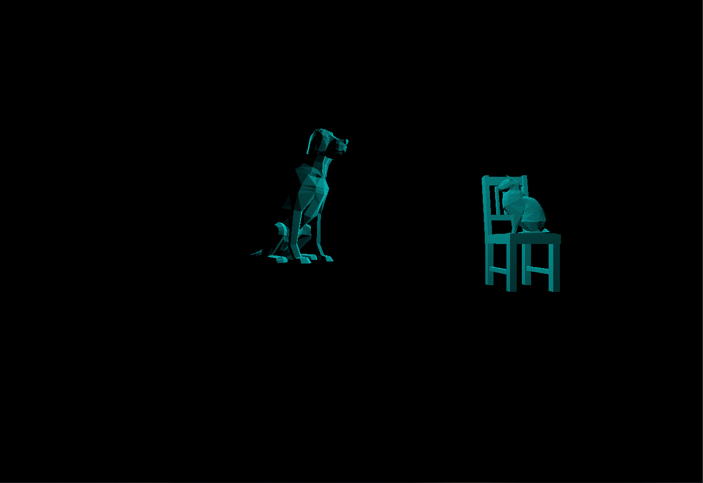
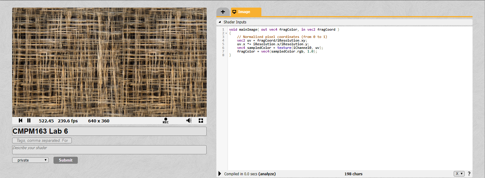
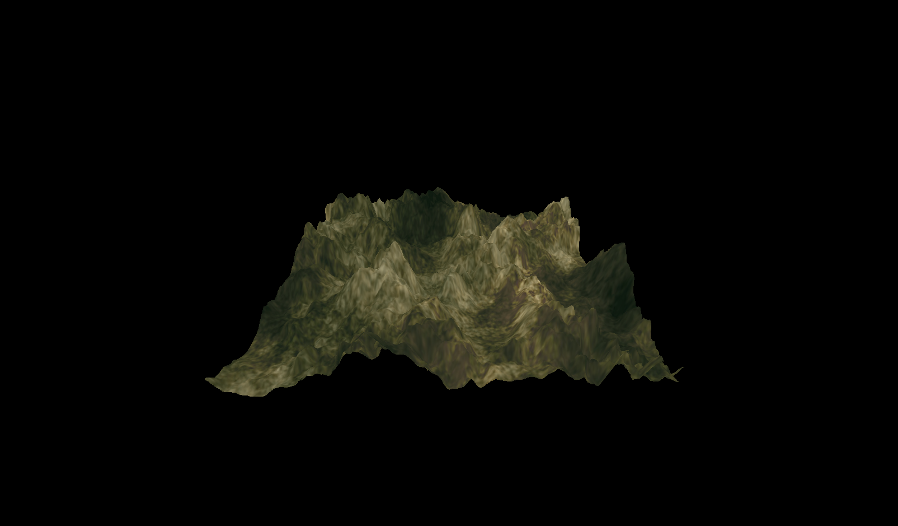
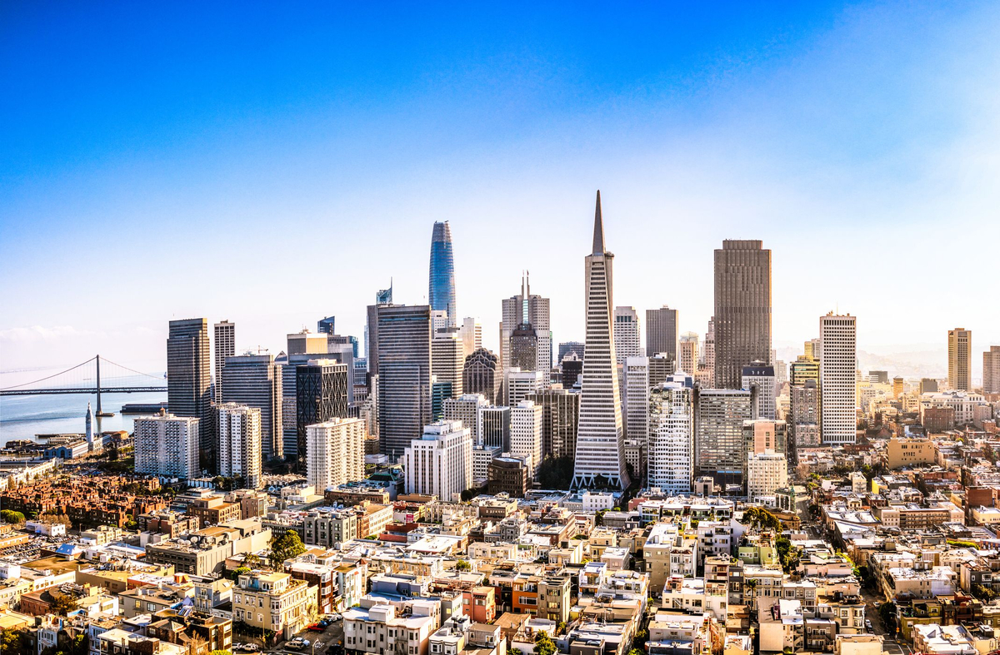
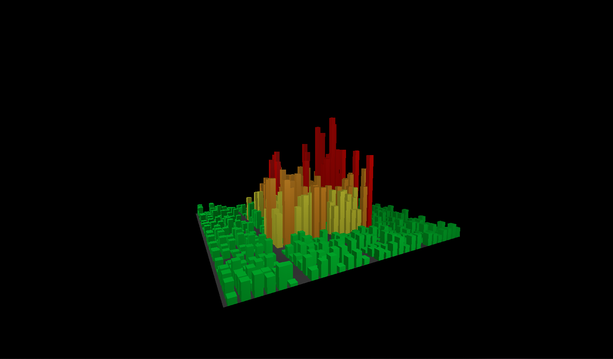

# Lab2:
[Click here for Part 1](https://drive.google.com/open?id=12XcsJsSQLhoWVwr6jooyYJFzUEKQgkJX)  
Part 2:  

# Lab3:
[Click here for Video](https://drive.google.com/open?id=1FSYGRuUAHmQMaXYK3yGAJXEnI6veuW-t)
# Lab4:
a: Given x, u = x / (texture_width - 1). So x = u * (texture_width - 1) -> x = u * 7  
b: Given y, v = 1 - y/texture_height. So y = (1-v) * (texture_height - 1) -> y = 7(1-v)  
c: (0.375, 0.25) correspond to (2.625, 5.25)  if we take floor of these coords we get (2, 5) -> gray pixel  
[Click here for Video](https://drive.google.com/open?id=1aXsg3D2UseHUt3qSQU3OBM-qIoriGPzQ)
# Lab5:
5a:
[Click here for Video](https://drive.google.com/open?id=1bt1tu0YAkmIwvzpCUEo9D3sHz7EU3zg1)  
5b:
[Click here for Video](https://drive.google.com/open?id=1wmnDQWku3Y5MdPg2sjVgKrIt_2EmgLEN)  
5bb:
[Click here for Video](https://drive.google.com/open?id=1vvqWBPhnCWEwygEjhkNxzmH8uSVtoeUj)
# Lab6:
Part1:  
  
Part2:
[Click here](https://www.shadertoy.com/view/tdBfzz)  
Something someone else did:
[Click here](https://www.shadertoy.com/view/3slcWr)
# Lab7:
Part2a:  
  
Part2b:  
[Click here for Video](https://drive.google.com/open?id=1Izq3KIHB8mFfD62_Nob3VJSXaI0BrWPa)  
Part2c:  
[Click here for Video](https://drive.google.com/open?id=1hGBR_mecuxFLAuC3sk8j9HXsT7CX8cQj)  
Partner Answers:  
Name: Carlos Cisneros  
1. I did Part 1  
2. Trying to make a mountain range from a plane using the shader graph was the most difficult.  
3. I liked working with the shader graph from the first part 1 of the Unity assignment.  
# Lab8:  
Source image is of a part of San Francisco, the middle buildings are taller than the buildings surrounding it.  
I edited the spawning algorithm to reflect this. I have also color coded the buildings based on its height.  
Part2 Source:  
  
Part2 Generated:  
  
